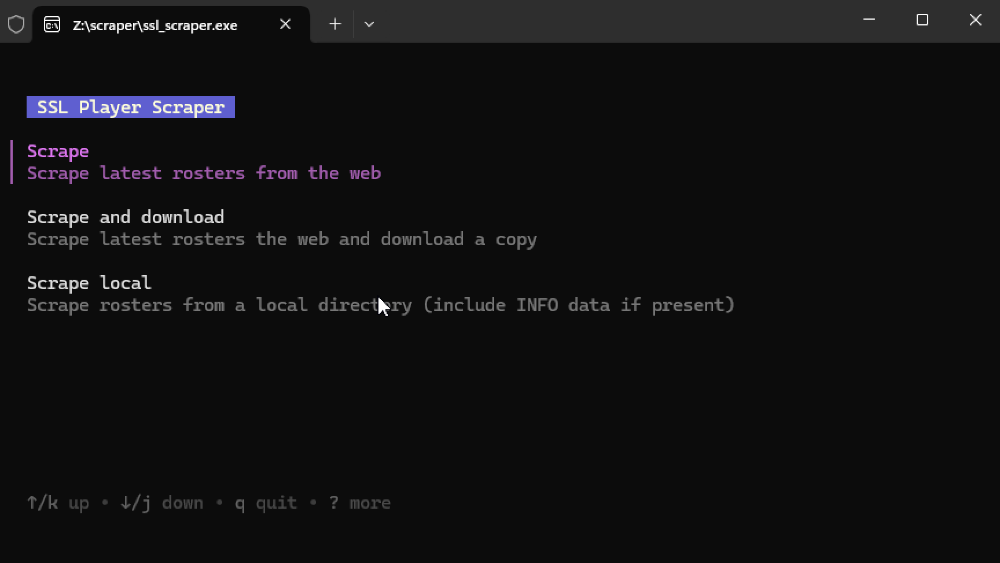
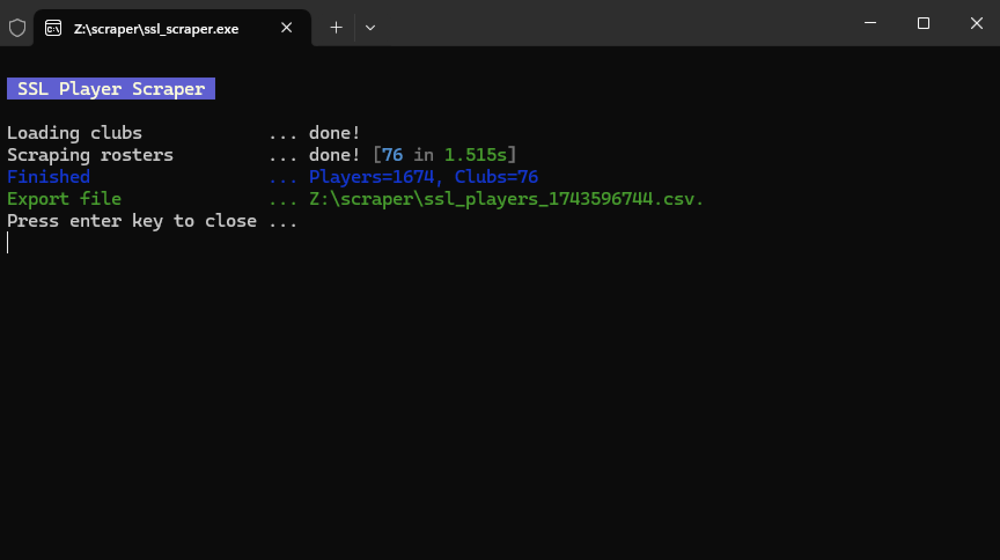

# player-scraper
A utility for generating a CSV export of all players for a particular ESMS game.

### Supported games

- [SSL](http://www.ssl2001.ukhome.net)
- [FFO](https://ffomanager.com)

## Usage

### Windows

1. Download the [latest version](https://github.com/esmshub/player-scraper/releases/latest) of the scraper for your OS. If you are unsure about which version you need, [see this guide](#versions)

    


2. Double click the exe to run with the [default settings](#Configuration) (UI mode is enabled by default)

    

    Choose your scrape mode and fill out the required fields (or accept the default values).

3. Once finished, you should see something like this:

    

     *_If there are any errors during the scrape those will be listed at the bottom, the scraper will still generate a final report with the information it was able to scrape._
     
     At this point the scraper is done so you can go ahead and press the Enter/Return key to close the window. A CSV formatted report containing all player information should now be available in the output directory you specified (or the default location) e.g.

    

4. Open the generated CSV file (i.e. `<game>_players_<timestamp>.csv`) in Excel (or equivalent) for advanced search & filtering

    


### Mac / Linux
```
# SSL
./ssl_scraper

# FFO
./ffo_scraper
```

### Configuration

The configuration options are mostly the same across all games, if you want to see what options are available run the executable from the command line with the `-h` flag 

```
<Game> Player Scraper
------------------
Usage of <game>_scraper:
  -ci
        Run in CI mode and disable prompts (default false)
  -download-files
        Download the latest rosters from the <Game> website (default false)
  -max-concurrent int
        Number of concurrent requests when loading rosters (default 5)
  -output-dir string
        Output directory for CSV files (default ".")
  -rosters-dir string
        Target directory for downloading or sourcing local rosters (default ".")
  -stop-on-error
        Stop all requests on first error (default false)
  -teams-url string
        URL to scrape for team information on <Game> website (default "<url>")
```

### CI mode

If looking to run the scraper in a CI environment or from a script, pass the `-ci` flag to disable the UI prompts.

1. Open Command Prompt / Terminal
2. Switch to directory executable is in e.g. `cd C:\path\to\rosters`
3. Call the executable with the `-ci` flag and [configure](#configuration) with the appropriate flags e.g.
```
# an example of a scrape + download
C:\path\to\rosters> ssl_scraper -ci -download-files
```

**Scenario 1 - Increase the scrape speed**

The throughput of the scraper can be adjusted via the `-max-concurrent` flag. The default is `5`, if you increased this to say `10` then the scrape should run in half the time (and vice versa) i.e.
```
<game>_scraper -max-concurrent=10
```

*Note - be mindful that increasing the concurrency will put additional load onto the relevant game website (and your local machine) so use sensibly*

**Scenario 2 - Stop the scrape if an error occurs at any point**

By default, the scraper will ignore errors and keep going. If you want to stop the scraper as soon as possible then use the `-stop-on-error` flag:
```
<game>_scraper -stop-on-error
```

## Troubleshooting

### My virus-scanning software thinks the application is infected
Your virus-scanning software may flag this application, but there’s no cause for concern. This is a well-known issue with applications built using the Go programming language. You can find more details here: [Go FAQ](https://go.dev/doc/faq#virus).

Our application is completely open-source, meaning anyone can inspect the code to verify its safety. If you have any concerns, you’re welcome to review the source code yourself or run additional independent checks.

## Versions

OS | Arch | File
--- | --- | ---
Windows 10 or later | 64-bit | `*.windows_amd64.zip`
Windows 10 or later | 32-bit | `*.windows_386.zip`
Windows 7 or later | 64-bit | `*.win7_amd64.zip`
Windows 7 or later | 32-bit | `*.win7_386.zip`
macOS 10.15 Catalina or later | Universal | `*.darwin.zip`
Linux (most distributions) | 64-bit | `*.linux_amd64.tar.gz`