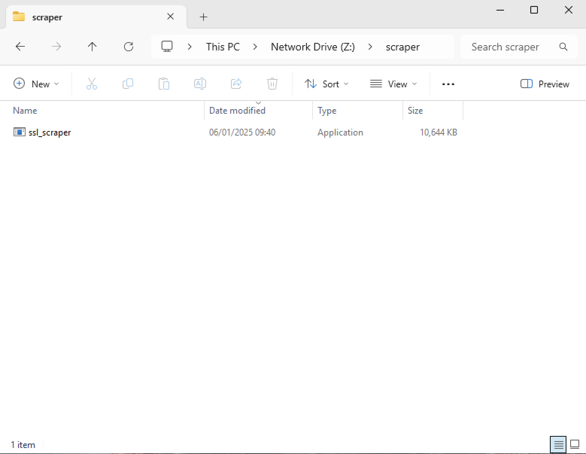
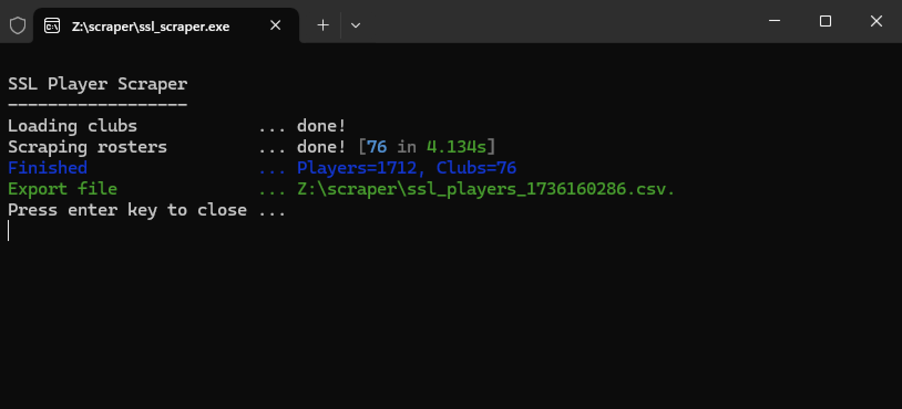
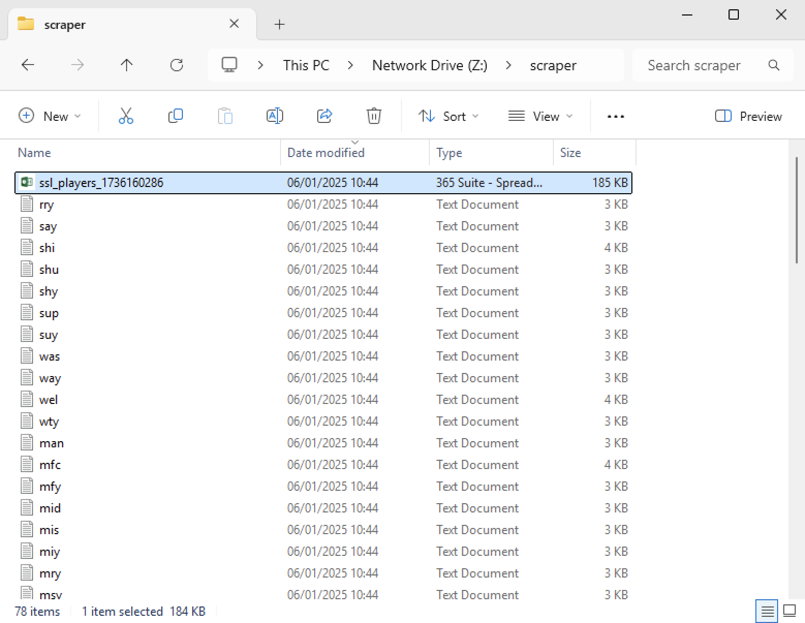
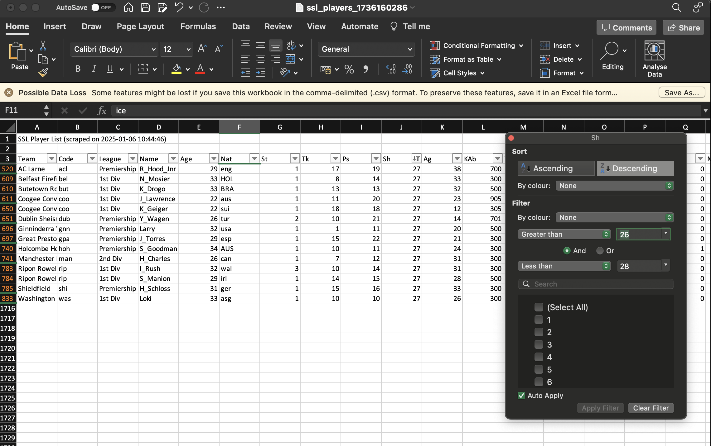

# player-scraper
A utility for generating a CSV export of all players for a particular ESMS game.

### Supported games

- [SSL](http://www.ssl2001.ukhome.net)
- [FFO](https://ffomanager.com)

## Usage

### Windows

1. Download the appropriate [scraper version](#versions) for your OS and unzip the exe

    


2. Double click the exe to run the [default behaviour](#default-behaviour)

    

    Notice the generated CSV file and missing rosters have been downloaded

    

3. Open the generated CSV file (i.e. `<game>_players_<timestamp>.csv`) in Excel (or equivalent) for advanced search & filtering

    

#### Running from the CLI

1. Open Command Prompt
2. Switch to directory executable is in e.g. `cd C:\path\to\rosters`
3. Call the executable to run the [default behaviour](#default-behaviour) or [configure](#configuration) with the appropriate flags e.g.
```
C:\path\to\rosters> ssl_scraper
```

### Mac / Linux
```
# SSL
./ssl_scraper

# FFO
./ffo_scraper
```

### Configuration

The configuration options are mostly the same across all games, if you want to see what options are available run the executable from the command line with the `-h` flag 

```
<Game> Player Scraper
------------------
Usage of <game>_scraper:
  -download-files
        Download rosters from the <Game> website if missing (default true)
  -max-concurrent int
        Number of concurrent requests when loading rosters (default 5)
  -output-dir string
        Output directory for CSV files (default ".")
  -rosters-dir string
        Location of local rosters (default ".")
  -stop-on-error
        Stop all requests on first error (default true)
  -teams-url string
        URL to scrape for team information on <Game> website (default "<url>")
```

#### Default behaviour

The application is setup for the most common usecase i.e. source rosters from the current directory and download them from the relevant website where missing. 

For example, if `abc` club does not have a local roster file (i.e. `abc.txt`) then `abc.txt` will be downloaded into the roster directory as part of the scrape.

This behaviour can be tweaked slightly via the [configuration flags](#configuration) e.g.

**Scenario 1 - Increase the scrape speed**

The throughput of the scraper can be adjusted via the `-max-concurrent` flag. The default is `5`, if you increased this to say `10` then the scrape should run in half the time (and vice versa) i.e.
```
<game>_scraper -max-concurrent=10
```

*Note - be mindful that increasing the concurrency will put additional load onto the relevant game website (and your local machine) so use sensibly*

**Scenario 2 - Avoid downloading rosters**

You can stop the scraper from downloading rosters by running the executable with the `-download-files` flag to false i.e.
```
<game>_scraper -download-files=false
```

**Scenario 2 - Change the roster file location**

If you are running the scraper in a different location from your roster files, then you can pass the `-rosters-dir` flag to tell it where to find them. Otherwise the application will assume you have no rosters and source them remotely:
```
C:\scraper> <game>_scraper -rosters-dir=C:\esms\rosters
```
*Note - this does not determine where the generated output goes, see **Scenario 3**

**Scenario 3 - Change the output directory**

If you want to change the location of where the generated CSV then you can pass the `-output-dir` flag
```
C:\scraper> <game>_scraper -output-dir=C:\esms\data
```

## Versions

OS | Arch
--- | ---
Windows 10 or later | `<game>_scraper.win10.x86_64.zip`
Windows 10 or later (32-bit) | `<game>_scraper.win10.i386.zip`
Windows 7 or later | `<game>_scraper.win7.x86_64.zip`
Windows 7 or later (32-bit) | `<game>_scraper.win7.i386.zip`
macOS 10.15 Catalina or later | `<game>_scraper.darwin.x86_64.zip`
Linux (most distributions) | `<game>_scraper.linux.x86_64.zip`


